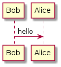

# Redmine PlantUML Macro Plugin

This plugin adds a `plantuml` graph macro to wiki formated fields.
This plugin uses POST requests, so you should have an external server set up that accepts PlantUML POST requests.

About PlantUML: https://plantuml.com/

## Example

```
{{plantuml
@startuml
Bob -> Alice : hello
@enduml
}}
```



## Installation

1. Clone or copy files into the Redmine plugins directory
   ```
   git clone https://github.com/cloudrainstar/redmine_plantuml_macro.git plugins/redmine_plantuml_macro
   ```
2. Restart Redmine

## Configration

You can configure the external `plantuml` server URL on `Administration -> Plugins` page.
Default value is PlantUML Online Server, but this will not work.
http://www.plantuml.com/svg/

## License

[MIT](LICENSE)
